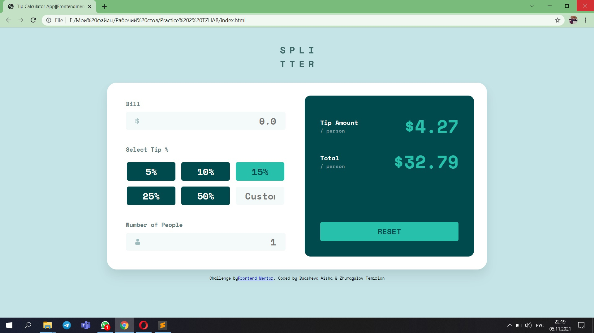

# Frontend Mentor - Tip calculator app solution

This is a solution to the [Tip calculator app challenge on Frontend Mentor](https://www.frontendmentor.io/challenges/tip-calculator-app-ugJNGbJUX). Frontend Mentor challenges help you improve your coding skills by building realistic projects.

## Table of contents

- [Overview](#overview)
  - [The challenge](#the-challenge)
  - [Screenshot](#screenshot)
  - [Links](#links)
- [My process](#my-process)
  - [Built with](#built-with)
  - [What I learned](#what-i-learned)
  - [Continued development](#continued-development)
  - [Useful resources](#useful-resources)
- [Author](#author)
- [Acknowledgments](#acknowledgments)

## Overview

### The challenge

Users should be able to:

- View the optimal layout for the app depending on their device's screen size
- See hover states for all interactive elements on the page
- Calculate the correct tip and total cost of the bill per person

### Screenshot



### Links

- Solution URL: [Add solution URL here](https://your-solution-url.com)
- Live Site URL: [Add live site URL here](https://your-live-site-url.com)

## My process

### Built with

- Semantic HTML5 markup
- CSS custom properties
- Flexbox
- CSS Grid
- Mobile-first workflow

### What I learned

```html
<link href="https://fonts.googleapis.com/css2?family=Space+Mono:wght@400;700&display=swap" rel="stylesheet"> 
<link rel="stylesheet" href="styles.css">
```
```css
@-webkit-keyframes show-err {
  0% {
    opacity: 0;
  }
  25% {
    opacity: 1;
  }
  75% {
    opacity: 1;
  }
  100% {
    opacity: 0;
  }
}

@media screen and (min-width: 1440px) {
  .card {
    width: 64%;
    -webkit-box-orient: horizontal;
    -webkit-box-direction: normal;
        -ms-flex-direction: row;
            flex-direction: row;
    border-radius: 2.5rem;
    -webkit-box-align: stretch;
        -ms-flex-align: stretch;
            align-items: stretch;
    padding: 3.4rem;
    gap: 1.5rem;
    -webkit-box-shadow: 0px 10px 20px rgba(0, 0, 0, 0.05), 0px 20px 30px rgba(0, 0, 0, 0.05);
            box-shadow: 0px 10px 20px rgba(0, 0, 0, 0.05), 0px 20px 30px rgba(0, 0, 0, 0.05);
  }
```
```js
function validateFloat(s){
    var rgx = /^[0-9]*\.?[0-9]*$/;
    return s.match(rgx);
}
```

### Useful resources

- [W3SCHOOLS](https://www.w3schools.com/js/) - This helped me for writing data validations to check if the email input is correct. I really liked this and will use it going forward.
- [W3SCHOOLS](https://www.w3schools.com/css/default.asp) - it helped me remember how to use different properties of CSS. I'd recommend it to anyone.
- [Geeksforgeek](https://www.geeksforgeeks.org) - useful platform to study css

## Author

- Website - [Buasheva Aisha & Zhumagulov Temirlan](https://www.your-site.com)
- Frontend Mentor of Temirlan - [@TemirlanZhumagulov ](https://www.frontendmentor.io/profile/TemirlanZhumagulov)
- Frontend Mentor of Aisha - [@Aisbv2](https://www.frontendmentor.io/profile/Aisbv2)

## Acknowledgments

I am grateful to my classmate for participating in coding, thereby greatly facilitating the task. It will help me in developing my web site creating skills.
